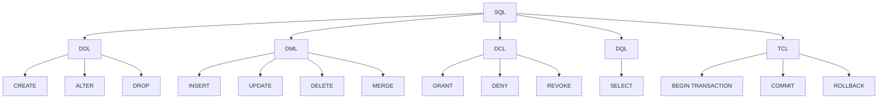
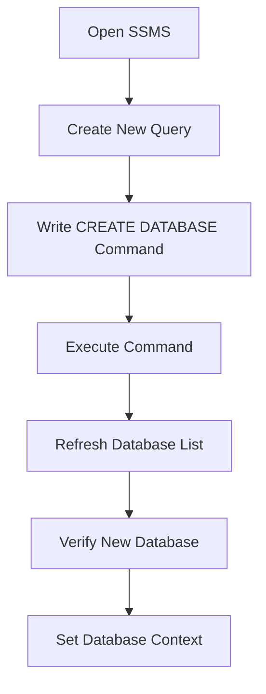
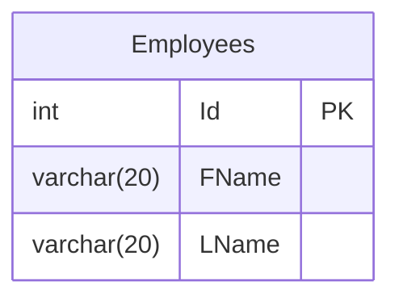
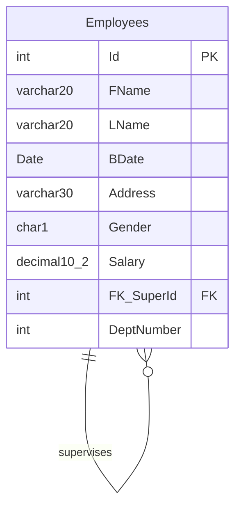
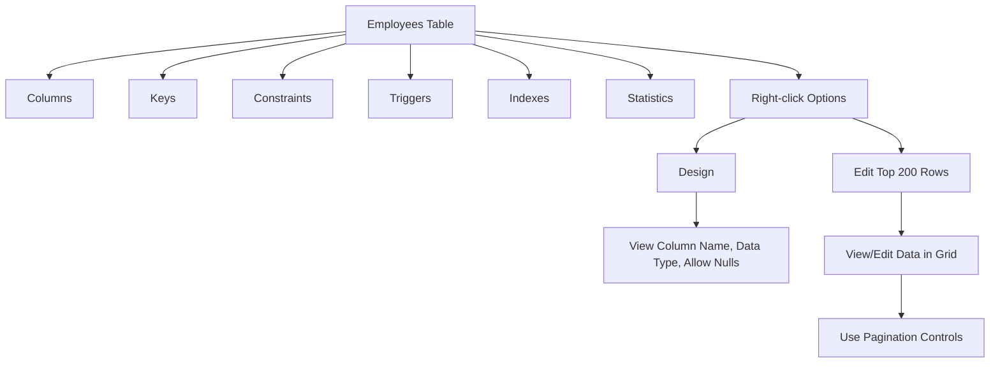
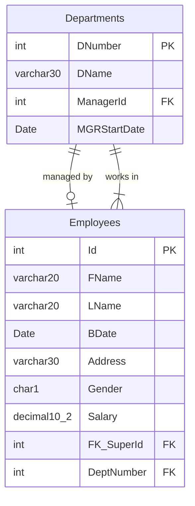
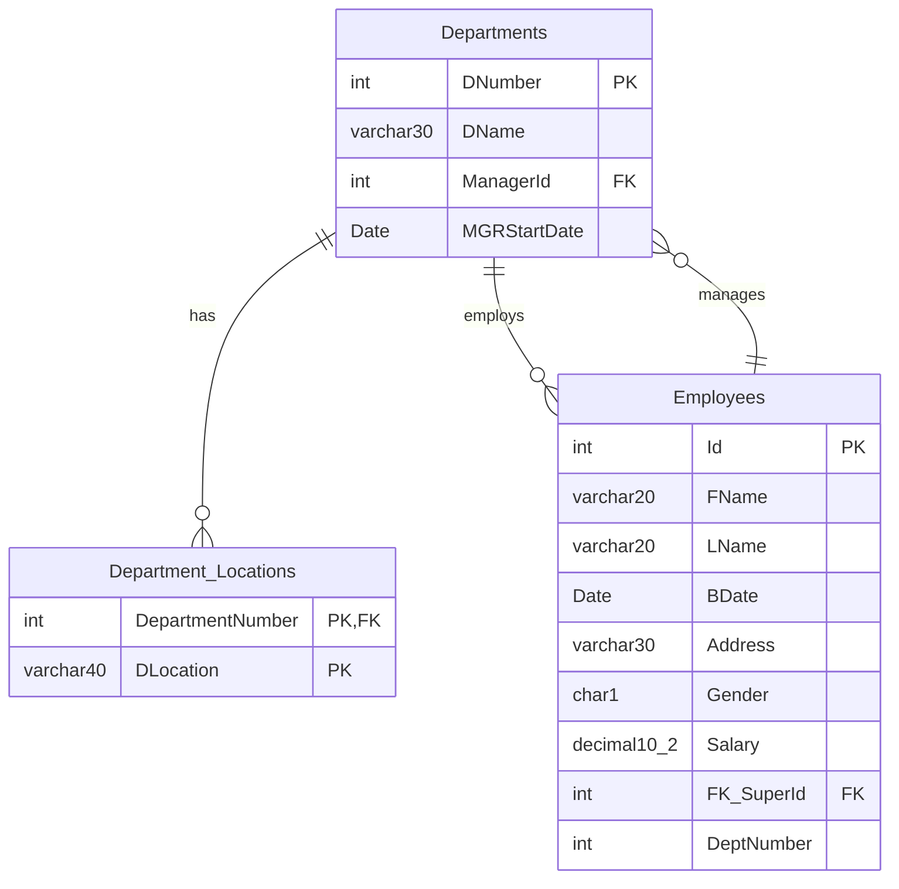
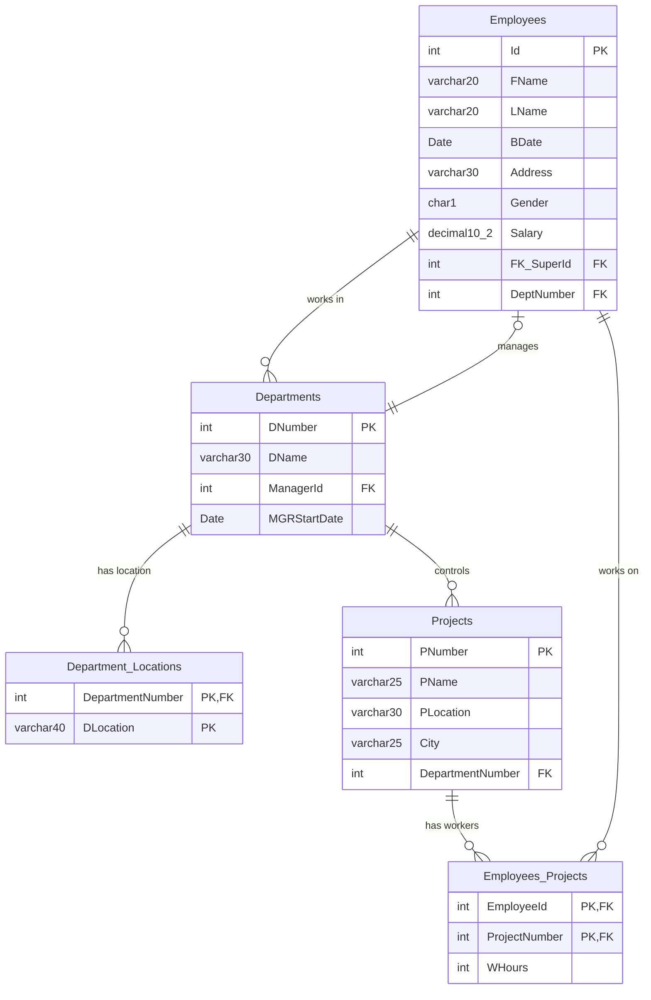

# SQL and Database Overview

## History and Variants

- **ANSI SQL**: Standardized by the American National Standards Institute (ANSI)
- **T-SQL (Transact-SQL)**: Microsoft's implementation
- **PL/SQL**: Oracle's implementation
- **SQL/PL**: IBM's implementation
- **MySQL**: Open-source implementation

## SQL Categories

### 1. DDL (Data Definition Language)
Focus: Metadata and structure

Operations:
- CREATE
- ALTER
- DROP

Examples:
```sql
CREATE TABLE
CREATE VIEW
CREATE FUNCTION
CREATE DATABASE
ALTER TABLE
DROP TABLE
```

### 2. DML (Data Manipulation Language)
Focus: Data operations

Operations:
- INSERT
- UPDATE
- DELETE
- MERGE

### 3. DCL (Data Control Language)
Focus: Security and permissions

Operations:
- GRANT
- DENY
- REVOKE

### 4. DQL (Data Query Language)
Focus: Data retrieval and analysis

Main operation:
- SELECT

Features:
- Aggregate functions
- Grouping
- UNION
- JOINS
- Subqueries

### 5. TCL (Transaction Control Language)
Focus: Transaction management

Operations:
- BEGIN TRANSACTION
- COMMIT
- ROLLBACK

## Database Objects

- Tables
- Views
- Functions
- Stored Procedures
- Indexes

## Simple Diagram



This overview provides a structured look at SQL categories, their focuses, and main operations. It also includes a simple diagram to visualize the relationships between different SQL components.


# Creating a Database in SQL Server Management Studio (SSMS)

## Steps to Create a Database

1. **Open SQL Server Management Studio (SSMS)**
   - SSMS is a graphical tool for managing SQL Server databases

2. **Create a New Query**
   - Click on "New Query" to open a new query window

3. **Write the CREATE DATABASE command**
   ```sql
   CREATE DATABASE CompanyG02
   ```

4. **Execute the command**
   - Select the command and press F5, or click the "Execute" button

5. **Refresh the database list**
   - Right-click on "Databases" in the Object Explorer and select "Refresh"

6. **Verify the new database**
   - Look for "CompanyG02" in the list of databases
   - It will have folders for different object types (Tables, Views, etc.)

7. **Set the context to the new database**
   ```sql
   USE CompanyG02
   GO
   ```

## Visual Process Flow



## Key Points

- This process uses Data Definition Language (DDL), specifically the CREATE command
- The database name (CompanyG02) can be changed as needed
- After creation, the database will be empty and ready for you to add tables and other objects
- Using the USE command ensures subsequent commands apply to your new database

# Creating a Table in SQL Server Management Studio (SSMS)

## Switching to the Correct Database

Before creating a table, ensure you're working in the correct database:

1. **Use the USE statement:**
   ```sql
   USE CompanyG02
   GO
   ```

2. **Or use the GUI:**
   - Select your database from the dropdown menu in SSMS

## Creating the Employees Table

Here's the SQL command to create an Employees table:

```sql
CREATE TABLE Employees
(
    FName varchar(20) NOT NULL,  -- Required
    LName varchar(20) NULL,      -- Optional
    Id int PRIMARY KEY IDENTITY(1,1)
)
```

### Breakdown of the Table Structure:

1. **Table Name:** Employees (plural)

2. **Columns:**
   - `FName`: First Name
     - Type: varchar(20)
     - Constraint: NOT NULL (Required)
   - `LName`: Last Name
     - Type: varchar(20)
     - Constraint: NULL (Optional, default behavior)
   - `Id`: Employee ID
     - Type: int
     - Constraints: 
       - PRIMARY KEY
       - IDENTITY(1,1) (Auto-incrementing)

## Key Points:

- By default, columns allow NULL values (optional) unless specified otherwise
- The PRIMARY KEY constraint ensures each row has a unique identifier
- The IDENTITY(1,1) constraint auto-generates ID values:
  - Seed (starting value): 1
  - Increment: 1

## Visual Table Structure



Remember to execute the CREATE TABLE command in SSMS to create the table in your database.


# Creating the Employees Table in SQL Server Management Studio (SSMS)

## Switching to the Correct Database

Before creating a table, ensure you're working in the correct database:

```sql
USE CompanyG02
GO
```

## Creating the Employees Table

Here's the SQL command to create an Employees table with all specified columns and constraints:

```sql
CREATE TABLE Employees
(
    Id int PRIMARY KEY IDENTITY(1,1),
    FName varchar(20) NOT NULL,
    LName varchar(20) NULL,
    BDate Date,
    [Address] varchar(30) DEFAULT 'Cairo',
    Gender char(1),
    Salary decimal(10,2),
    FK_SuperId int REFERENCES Employees(Id),
    DeptNumber int
)
```

### Breakdown of the Table Structure:

1. **Table Name:** Employees (plural)

2. **Columns:**
   - `Id`: Employee ID
     - Type: int
     - Constraints: PRIMARY KEY, IDENTITY(1,1) (Auto-incrementing)
   - `FName`: First Name
     - Type: varchar(20)
     - Constraint: NOT NULL (Required)
   - `LName`: Last Name
     - Type: varchar(20)
     - Constraint: NULL (Optional, default behavior)
   - `BDate`: Birth Date
     - Type: Date
   - `Address`: Employee Address
     - Type: varchar(30)
     - Constraint: DEFAULT 'Cairo'
   - `Gender`: Employee Gender
     - Type: char(1)
   - `Salary`: Employee Salary
     - Type: decimal(10,2) (10 digits total, 2 after decimal point)
   - `FK_SuperId`: Supervisor's ID
     - Type: int
     - Constraint: FOREIGN KEY referencing Employees(Id) (Self-relationship)
   - `DeptNumber`: Department Number
     - Type: int
     - Note: Will be set as a foreign key later

## Key Points:

1. The PRIMARY KEY (Id) is now the first column for better readability and performance.
2. `Address` is a reserved keyword, so it's enclosed in square brackets `[]`.
3. The `DEFAULT` constraint on `Address` sets 'Cairo' as the default value.
4. `Salary` is set as `decimal(10,2)` for precise monetary values.
5. `FK_SuperId` creates a self-relationship within the Employees table.
6. `DeptNumber` will be set as a foreign key to the Departments table later using an ALTER TABLE command.

## Visual Table Structure



## Execution

After writing the CREATE TABLE command in SSMS:
1. Select the entire command
2. Click "Execute" or press F5 to run the command

Remember to refresh your database objects in the Object Explorer to see the newly created table.

## Future Modifications

The `DeptNumber` column will be set as a foreign key referencing the Departments table after that table is created. This will be done using an ALTER TABLE command, which we'll cover in a future session.


## Table Structure in SSMS Object Explorer

After creating the Employees table, you'll see the following structure in the Object Explorer:

- Employees (table)
  - Columns
    - [List of all columns]
  - Keys
    - Primary Key (Id)
    - Foreign Key (FK_SuperId)
  - Constraints
    - Default constraint (Address)
  - Triggers
  - Indexes
  - Statistics

Note: The NOT NULL and IDENTITY constraints are not listed separately in the Constraints folder.

## Viewing Table Design

To view the table design:

1. Right-click on the Employees table in Object Explorer
2. Select "Design"

The design view shows three columns:
1. Column Name
2. Data Type
3. Allow Nulls

This view allows you to see the structure of your table at a glance and make modifications if needed.

## Viewing and Editing Table Data

To view and edit the data in the Employees table:

1. Right-click on the Employees table in Object Explorer
2. Select "Edit Top 200 Rows"

This opens a page showing:
- The first 200 employees in the table
- A grid-like interface for viewing and editing data
- Pagination controls at the bottom of the page for navigating through larger datasets

This view allows you to quickly inspect and modify the data in your table.

## Visual Representation of SSMS Interaction



This diagram illustrates the structure of the Employees table in SSMS Object Explorer and the options for interacting with it.


## Creating the Departments Table

Let's create the Departments table with all the specified columns and constraints. Here's the SQL command:

```sql
CREATE TABLE Departments
(
    DNumber int PRIMARY KEY IDENTITY(10,10),
    DName varchar(30) NOT NULL,
    ManagerId int REFERENCES Employees(Id),
    MGRStartDate Date
)
```

### Breakdown of the Table Structure:

1. **Table Name:** Departments (plural)

2. **Columns:**
   - `DNumber`: Department Number
     - Type: int
     - Constraints: 
       - PRIMARY KEY
       - IDENTITY(10,10) (Auto-incrementing, starting at 10, incrementing by 10)
   - `DName`: Department Name
     - Type: varchar(30)
     - Constraint: NOT NULL
   - `ManagerId`: Manager's Employee ID
     - Type: int
     - Constraint: FOREIGN KEY referencing Employees(Id)
   - `MGRStartDate`: Manager's Start Date
     - Type: Date

### Key Points:

- The IDENTITY(10,10) constraint auto-generates DNumber values:
  - Seed (starting value): 10
  - Increment: 10
  - This means the first department will have DNumber 10, the second 20, and so on.
- The `ManagerId` column establishes a one-to-one optional relationship with the Employees table:
  - Each department can have one manager (who is an employee)
  - An employee may or may not manage a department (optional from the employee side)
  - This is implemented by having the primary key of the Employees table (Id) as a foreign key in the Departments table (ManagerId)

### Visual Table Structure and Relationships



### Execution

After writing the CREATE TABLE command in SSMS:
1. Select the entire command
2. Click "Execute" or press F5 to run the command

Remember to refresh your database objects in the Object Explorer to see the newly created table.

## Relationships between Employees and Departments

Now that we have both the Employees and Departments tables, we can see two relationships:

1. Manager Relationship (One-to-One, Optional):
   - Represented by `ManagerId` in the Departments table
   - One department is managed by one employee (optional for the employee)

2. Employee-Department Relationship (Many-to-One):
   - Represented by `DeptNumber` in the Employees table
   - Many employees can work in one department

Note: We still need to add the foreign key constraint for `DeptNumber` in the Employees table. This will be done in a future step using an ALTER TABLE command.


## Creating the Department_Locations Table

Now, let's create the Department_Locations table to represent the multi-valued attribute of department locations. Here's the SQL command:

```sql
CREATE TABLE Department_Locations
(
    DepartmentNumber int REFERENCES Departments(DNumber),
    DLocation VARCHAR(40),
    PRIMARY KEY (DepartmentNumber, DLocation)
)
```

### Breakdown of the Table Structure:

1. **Table Name:** Department_Locations

2. **Columns:**
   - `DepartmentNumber`: Department Number
     - Type: int
     - Constraint: FOREIGN KEY referencing Departments(DNumber)
   - `DLocation`: Department Location
     - Type: VARCHAR(40)

3. **Primary Key:**
   - Composite key consisting of both `DepartmentNumber` and `DLocation`

### Key Points:

- This table represents a multi-valued attribute (locations) for departments.
- The primary key is a composite key, meaning it's made up of multiple columns (DepartmentNumber and DLocation).
- The `DepartmentNumber` is also a foreign key referencing the `DNumber` in the Departments table.
- This structure allows a department to have multiple locations, and each location for a department must be unique.

### Visual Table Structure and Relationships



### Execution

After writing the CREATE TABLE command in SSMS:
1. Select the entire command
2. Click "Execute" or press F5 to run the command

Remember to refresh your database objects in the Object Explorer to see the newly created table.

## Relationships Overview

1. Departments to Department_Locations (One-to-Many):
   - One department can have many locations
   - Implemented via the foreign key `DepartmentNumber` in Department_Locations

2. Departments to Employees (One-to-Many):
   - One department can have many employees
   - Implemented via the `DeptNumber` in Employees (to be added later)

3. Employees to Departments (One-to-One, Optional) for Manager:
   - One employee can manage at most one department
   - Implemented via the `ManagerId` in Departments

This structure allows for flexible representation of departments, their locations, and their employees, including management relationships.


## Creating the Projects Table

Let's create the Projects table with the specified columns and constraints. Here's the SQL command:

```sql
CREATE TABLE Projects
(
    PNumber int PRIMARY KEY IDENTITY(100,100),
    PName varchar(25) NOT NULL,
    PLocation varchar(30),
    City varchar(25),
    DepartmentNumber int REFERENCES Departments(DNumber)
)
```

### Breakdown of the Projects Table Structure:

1. **Table Name:** Projects

2. **Columns:**
   - `PNumber`: Project Number
     - Type: int
     - Constraints: PRIMARY KEY, IDENTITY(100,100)
   - `PName`: Project Name
     - Type: varchar(25)
     - Constraint: NOT NULL
   - `PLocation`: Project Location
     - Type: varchar(30)
   - `City`: Project City
     - Type: varchar(25)
   - `DepartmentNumber`: Controlling Department Number
     - Type: int
     - Constraint: FOREIGN KEY referencing Departments(DNumber)

### Key Points:

- The IDENTITY(100,100) constraint auto-generates PNumber values starting at 100 and incrementing by 100.
- Each project is associated with one controlling department (many-to-one relationship).

## Creating the Employees_Projects Table

Now, let's create the Employees_Projects table to represent the many-to-many relationship between Employees and Projects. Here's the SQL command:

```sql
CREATE TABLE Employees_Projects
(
    EmployeeId int REFERENCES Employees(Id),
    ProjectNumber int REFERENCES Projects(PNumber),
    WHours int,
    PRIMARY KEY (EmployeeId, ProjectNumber)
)
```

### Breakdown of the Employees_Projects Table Structure:

1. **Table Name:** Employees_Projects

2. **Columns:**
   - `EmployeeId`: Employee ID
     - Type: int
     - Constraint: FOREIGN KEY referencing Employees(Id)
   - `ProjectNumber`: Project Number
     - Type: int
     - Constraint: FOREIGN KEY referencing Projects(PNumber)
   - `WHours`: Working Hours
     - Type: int

3. **Primary Key:**
   - Composite key consisting of both `EmployeeId` and `ProjectNumber`

### Key Points:

- This table represents a many-to-many relationship between Employees and Projects.
- The primary key is a composite key, ensuring each employee-project combination is unique.
- The `WHours` column represents the hours an employee works on a specific project.

### Visual Table Structure and Relationships



### Execution

After writing each CREATE TABLE command in SSMS:
1. Select the entire command
2. Click "Execute" or press F5 to run the command

Remember to refresh your database objects in the Object Explorer to see the newly created tables.

## Relationships Overview

1. Employees to Departments (Many-to-One):
   - Many employees can work in one department
   - Implemented via the `DeptNumber` in Employees

2. Departments to Employees (One-to-One, Optional) for Manager:
   - One department is managed by one employee (optional for the employee)
   - Implemented via the `ManagerId` in Departments

3. Departments to Department_Locations (One-to-Many):
   - One department can have many locations
   - Implemented via the foreign key `DepartmentNumber` in Department_Locations

4. Departments to Projects (One-to-Many):
   - One department can control many projects
   - Implemented via the `DepartmentNumber` in Projects

5. Employees to Projects (Many-to-Many):
   - Many employees can work on many projects
   - Implemented via the Employees_Projects junction table

This structure allows for a comprehensive representation of employees, departments, projects, and their interrelationships in the database.

