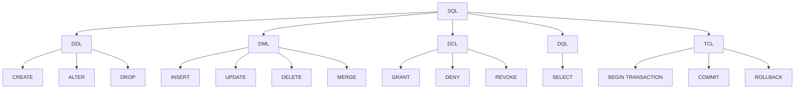

# SQL and Database Overview

## History and Variants

- **ANSI SQL**: Standardized by the American National Standards Institute (ANSI)
- **T-SQL (Transact-SQL)**: Microsoft's implementation
- **PL/SQL**: Oracle's implementation
- **SQL/PL**: IBM's implementation
- **MySQL**: Open-source implementation

## SQL Categories

### 1. DDL (Data Definition Language)
Focus: Metadata and structure

Operations:
- CREATE
- ALTER
- DROP

Examples:
```sql
CREATE TABLE
CREATE VIEW
CREATE FUNCTION
CREATE DATABASE
ALTER TABLE
DROP TABLE
```

### 2. DML (Data Manipulation Language)
Focus: Data operations

Operations:
- INSERT
- UPDATE
- DELETE
- MERGE

### 3. DCL (Data Control Language)
Focus: Security and permissions

Operations:
- GRANT
- DENY
- REVOKE

### 4. DQL (Data Query Language)
Focus: Data retrieval and analysis

Main operation:
- SELECT

Features:
- Aggregate functions
- Grouping
- UNION
- JOINS
- Subqueries

### 5. TCL (Transaction Control Language)
Focus: Transaction management

Operations:
- BEGIN TRANSACTION
- COMMIT
- ROLLBACK

## Database Objects

- Tables
- Views
- Functions
- Stored Procedures
- Indexes

## Simple Diagram



This overview provides a structured look at SQL categories, their focuses, and main operations. It also includes a simple diagram to visualize the relationships between different SQL components.
