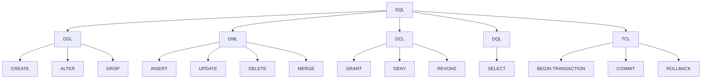
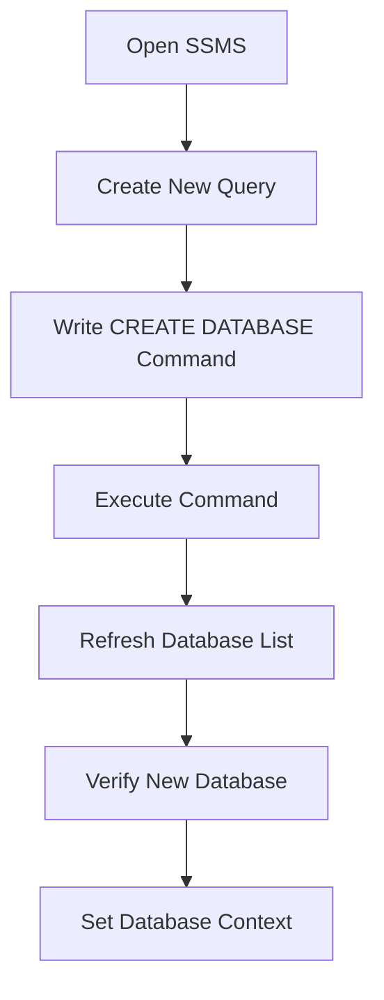
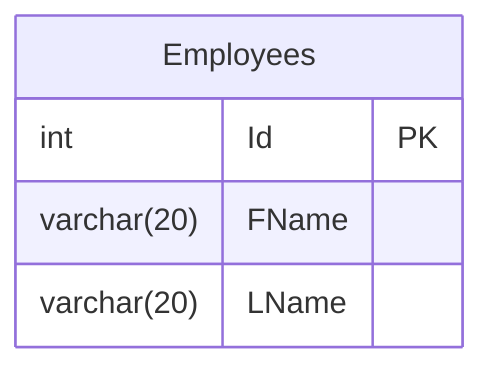
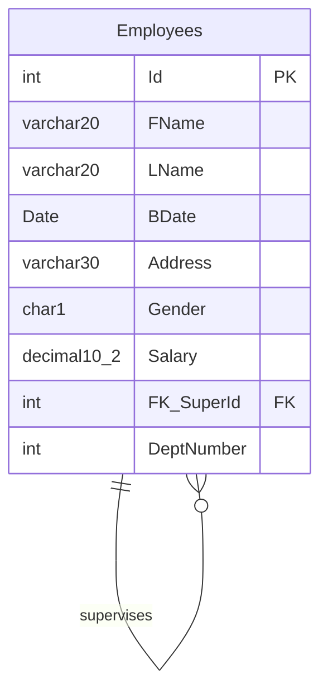

# SQL and Database Overview

## History and Variants

- **ANSI SQL**: Standardized by the American National Standards Institute (ANSI)
- **T-SQL (Transact-SQL)**: Microsoft's implementation
- **PL/SQL**: Oracle's implementation
- **SQL/PL**: IBM's implementation
- **MySQL**: Open-source implementation

## SQL Categories

### 1. DDL (Data Definition Language)
Focus: Metadata and structure

Operations:
- CREATE
- ALTER
- DROP

Examples:
```sql
CREATE TABLE
CREATE VIEW
CREATE FUNCTION
CREATE DATABASE
ALTER TABLE
DROP TABLE
```

### 2. DML (Data Manipulation Language)
Focus: Data operations

Operations:
- INSERT
- UPDATE
- DELETE
- MERGE

### 3. DCL (Data Control Language)
Focus: Security and permissions

Operations:
- GRANT
- DENY
- REVOKE

### 4. DQL (Data Query Language)
Focus: Data retrieval and analysis

Main operation:
- SELECT

Features:
- Aggregate functions
- Grouping
- UNION
- JOINS
- Subqueries

### 5. TCL (Transaction Control Language)
Focus: Transaction management

Operations:
- BEGIN TRANSACTION
- COMMIT
- ROLLBACK

## Database Objects

- Tables
- Views
- Functions
- Stored Procedures
- Indexes

## Simple Diagram



This overview provides a structured look at SQL categories, their focuses, and main operations. It also includes a simple diagram to visualize the relationships between different SQL components.


# Creating a Database in SQL Server Management Studio (SSMS)

## Steps to Create a Database

1. **Open SQL Server Management Studio (SSMS)**
   - SSMS is a graphical tool for managing SQL Server databases

2. **Create a New Query**
   - Click on "New Query" to open a new query window

3. **Write the CREATE DATABASE command**
   ```sql
   CREATE DATABASE CompanyG02
   ```

4. **Execute the command**
   - Select the command and press F5, or click the "Execute" button

5. **Refresh the database list**
   - Right-click on "Databases" in the Object Explorer and select "Refresh"

6. **Verify the new database**
   - Look for "CompanyG02" in the list of databases
   - It will have folders for different object types (Tables, Views, etc.)

7. **Set the context to the new database**
   ```sql
   USE CompanyG02
   GO
   ```

## Visual Process Flow



## Key Points

- This process uses Data Definition Language (DDL), specifically the CREATE command
- The database name (CompanyG02) can be changed as needed
- After creation, the database will be empty and ready for you to add tables and other objects
- Using the USE command ensures subsequent commands apply to your new database

# Creating a Table in SQL Server Management Studio (SSMS)

## Switching to the Correct Database

Before creating a table, ensure you're working in the correct database:

1. **Use the USE statement:**
   ```sql
   USE CompanyG02
   GO
   ```

2. **Or use the GUI:**
   - Select your database from the dropdown menu in SSMS

## Creating the Employees Table

Here's the SQL command to create an Employees table:

```sql
CREATE TABLE Employees
(
    FName varchar(20) NOT NULL,  -- Required
    LName varchar(20) NULL,      -- Optional
    Id int PRIMARY KEY IDENTITY(1,1)
)
```

### Breakdown of the Table Structure:

1. **Table Name:** Employees (plural)

2. **Columns:**
   - `FName`: First Name
     - Type: varchar(20)
     - Constraint: NOT NULL (Required)
   - `LName`: Last Name
     - Type: varchar(20)
     - Constraint: NULL (Optional, default behavior)
   - `Id`: Employee ID
     - Type: int
     - Constraints: 
       - PRIMARY KEY
       - IDENTITY(1,1) (Auto-incrementing)

## Key Points:

- By default, columns allow NULL values (optional) unless specified otherwise
- The PRIMARY KEY constraint ensures each row has a unique identifier
- The IDENTITY(1,1) constraint auto-generates ID values:
  - Seed (starting value): 1
  - Increment: 1

## Visual Table Structure



Remember to execute the CREATE TABLE command in SSMS to create the table in your database.


# Creating the Employees Table in SQL Server Management Studio (SSMS)

## Switching to the Correct Database

Before creating a table, ensure you're working in the correct database:

```sql
USE CompanyG02
GO
```

## Creating the Employees Table

Here's the SQL command to create an Employees table with all specified columns and constraints:

```sql
CREATE TABLE Employees
(
    Id int PRIMARY KEY IDENTITY(1,1),
    FName varchar(20) NOT NULL,
    LName varchar(20) NULL,
    BDate Date,
    [Address] varchar(30) DEFAULT 'Cairo',
    Gender char(1),
    Salary decimal(10,2),
    FK_SuperId int REFERENCES Employees(Id),
    DeptNumber int
)
```

### Breakdown of the Table Structure:

1. **Table Name:** Employees (plural)

2. **Columns:**
   - `Id`: Employee ID
     - Type: int
     - Constraints: PRIMARY KEY, IDENTITY(1,1) (Auto-incrementing)
   - `FName`: First Name
     - Type: varchar(20)
     - Constraint: NOT NULL (Required)
   - `LName`: Last Name
     - Type: varchar(20)
     - Constraint: NULL (Optional, default behavior)
   - `BDate`: Birth Date
     - Type: Date
   - `Address`: Employee Address
     - Type: varchar(30)
     - Constraint: DEFAULT 'Cairo'
   - `Gender`: Employee Gender
     - Type: char(1)
   - `Salary`: Employee Salary
     - Type: decimal(10,2) (10 digits total, 2 after decimal point)
   - `FK_SuperId`: Supervisor's ID
     - Type: int
     - Constraint: FOREIGN KEY referencing Employees(Id) (Self-relationship)
   - `DeptNumber`: Department Number
     - Type: int
     - Note: Will be set as a foreign key later

## Key Points:

1. The PRIMARY KEY (Id) is now the first column for better readability and performance.
2. `Address` is a reserved keyword, so it's enclosed in square brackets `[]`.
3. The `DEFAULT` constraint on `Address` sets 'Cairo' as the default value.
4. `Salary` is set as `decimal(10,2)` for precise monetary values.
5. `FK_SuperId` creates a self-relationship within the Employees table.
6. `DeptNumber` will be set as a foreign key to the Departments table later using an ALTER TABLE command.

## Visual Table Structure



## Execution

After writing the CREATE TABLE command in SSMS:
1. Select the entire command
2. Click "Execute" or press F5 to run the command

Remember to refresh your database objects in the Object Explorer to see the newly created table.

## Future Modifications

The `DeptNumber` column will be set as a foreign key referencing the Departments table after that table is created. This will be done using an ALTER TABLE command, which we'll cover in a future session.
